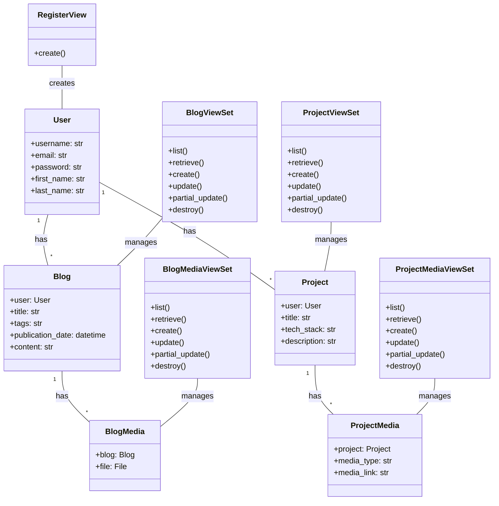

```mermaid
classDiagram
    class User {
        +username: str
        +email: str
        +password: str
        +first_name: str
        +last_name: str
    }

    class Blog {
        +user: User
        +title: str
        +tags: str
        +publication_date: datetime
        +content: str
    }

    class BlogMedia {
        +blog: Blog
        +file: File
    }

    class Project {
        +user: User
        +title: str
        +tech_stack: str
        +description: str
    }

    class ProjectMedia {
        +project: Project
        +media_type: str
        +media_link: str
    }

    class BlogViewSet {
        +list()
        +retrieve()
        +create()
        +update()
        +partial_update()
        +destroy()
    }

    class BlogMediaViewSet {
        +list()
        +retrieve()
        +create()
        +update()
        +partial_update()
        +destroy()
    }

    class ProjectViewSet {
        +list()
        +retrieve()
        +create()
        +update()
        +partial_update()
        +destroy()
    }

    class ProjectMediaViewSet {
        +list()
        +retrieve()
        +create()
        +update()
        +partial_update()
        +destroy()
    }

    class RegisterView {
        +create()
    }

    User "1" -- "*" Blog: has
    User "1" -- "*" Project: has
    Blog "1" -- "*" BlogMedia: has
    Project "1" -- "*" ProjectMedia: has
    
    BlogViewSet -- Blog: manages
    BlogMediaViewSet -- BlogMedia: manages
    ProjectViewSet -- Project: manages
    ProjectMediaViewSet -- ProjectMedia: manages
    RegisterView -- User: creates
```